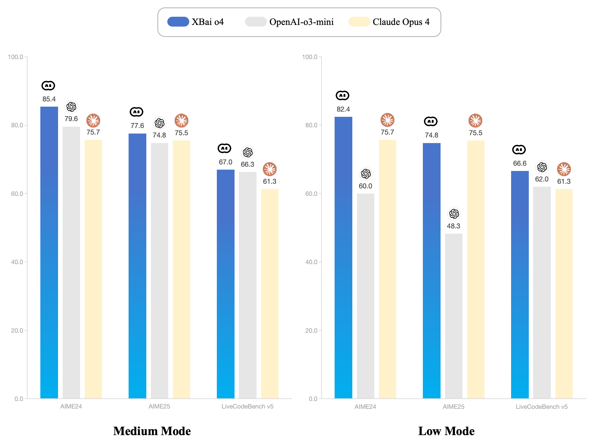
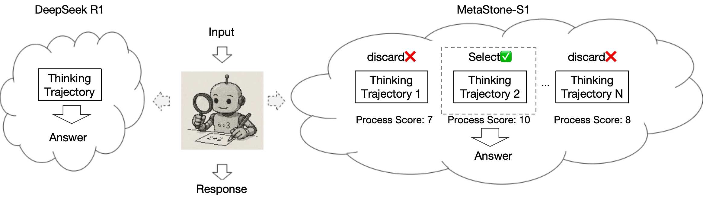

<div align="center">
  <br>
  <a href="./README.md">English</a> &nbsp;|&nbsp;
  <a href="./README_zh.md">简体中文</a>
</div>

## News
+ **2025.08.01**: We release **XBai o4**, where *o=open*, and o4 represents our fourth-generation open-source large model technology. **XBai o4** excels in complex reasoning capabilities and has now completely surpassed OpenAI-o3-mini in Medium mode. View the [ModelCard](https://huggingface.co/MetaStoneTec/XBai-o4) to get more information!

## Introduction


**XBai o4** is trained based on our proposed **reflective generative form, which combines “Long-CoT Reinforcement Learning” and “Process Reward Learning” into a unified training form**.
This form enables a single model to simultaneously achieve deep reasoning and high-quality reasoning trajectory selection.
By sharing the backbone network between the PRMs and policy models, XBai o4 significantly reduces the inference cost of PRMs by 99%, resulting in faster and higher-quality responses.



This repo contains the training and evaluation code of XBai o4. For full details please refer to our paper [《Test-Time Scaling with Reflective Generative Model》](https://arxiv.org/abs/2507.01951) and [our official website](https://www.wenxiaobai.com/).

## Installation
```bash
conda create -n xbai_o4 python==3.10 
conda activate xbai_o4
pip install -e verl
pip install -r requirements.txt
pip install flash_attn==2.7.4.post1
```

## Model Zoo

| Model|Transformers(HF) | ModelScope |
|---------------|---------|---------|
|XBai o4|[XBai o4](https://huggingface.co/MetaStoneTec/XBai-o4)|[XBai o4](https://modelscope.cn/models/MetaStoneTec/XBai-o4)|

## Performance

| Model                        | AIME24 | AIME25 | LiveCodeBench v5| C-EVAL |
|------------------------------|--------|--------|----------------|--------|
| s1-32B                       | 56.7   | 50.0   | -              | -      |
| QwQ-32B                      | 79.5   | 69.5   | 62.7           | 88.4   |
| R1-Distill-Qwen-32B          | 72.6   | 49.6   | 54.5           | 82.2   |
| GLM-Z1-32B-0414              | 80.8   | 63.6   | -            | -      |
| DeepSeek-R1-671B-0120             | 79.8   | 70.0   | 64.3    | **91.8** |
| Claude-3.5-Sonnet1022        | 16.0   | 7.4    | 40.2           | 76.7   |
| GPT-4o-0513                  | 9.3    | 11.6   | 32.3           | -      |
| OpenAI-o1-mini               | 63.6   | 50.7   | 49.4           | 68.9   |
| OpenAI-o1-1217               | 79.2   | -      | 63.9           | -      |
| OpenAI-o3-mini-medium        | 79.6   | 74.8 | 66.3   | 75.9   |
| Claude Opus 4                | 75.7   | 75.5 | 61.3   | -      |
| Qwen3-32B                    | 81.4   | 72.9 | 65.7   | 87.3   |
| **XBai o4-low** | 82.4   | 74.8   | 66.6           | 89.4   |
| **XBai o4-medium** | <ins>85.4</ins>   | <ins>77.6</ins>   | <ins>67.0</ins>           | 89.5   |
| **XBai o4-high** | **86.5** | **77.9**   | **67.2**           | <ins>89.7</ins>   |

## Train

#### Single-Node Training
```bash
export WANDB_API_KEY=YOUR_WANDB_API_KEY
bash ./scripts/run_single_node.sh
```

#### Multi-Node Training
```bash
# start ray
bash ./verl/examples/ray/run_worker_n.sh
# start training
bash ./scripts/run_multi_node.sh
```

#### Convert the checkpoint to Huggingface format
```bash
cd ./verl/scripts
bash model_merger.sh
```

## Evaluation
We now release the naive test pipeline for mathematical benchmarks.

#### Step 1: Run the API of the reward model
```bash
CUDA_VISIBLE_DEVICES=0 python test/score_model_queue.py --model_path path/to/huggingface/model --score_model_dim 1536 --lang 'en' --ip '0.0.0.0' --port '8001'
```

#### Step 2: Run the API of the policy model
```bash
export VLLM_ATTENTION_BACKEND=XFORMERS
CUDA_VISIBLE_DEVICES=0 python test/policy_model_queue.py --model_path path/to/huggingface/model --ip '0.0.0.0' --port '8000'
```
We recommend starting multiple policy model APIs for fast evaluation. 

#### Step 3: Inference on the target benchmark
```bash
python test/inference.py --task 'aime24' --input_file data/aime24.jsonl --output_file path/to/result --n_samples 16 --model_dir path/to/huggingface/model --score_api_url "http://ip:port/score" --response_api_url "http://ip1:port1/score,http://ip2:port2/score" --branch 2
```
We recommend setting the branch to 2× the number of policy model APIs

#### Step4: Compute the pass@1 metric
```bash
python test/compute_metric.py --task 'aime24' --result_paths path/to/result --N 2
```
Set N to 2/8/32 for low/medium/high mode

## Citation
If you find our work helpful, feel free to give us a cite.
```
@misc{wang2025testtimescalingreflectivegenerative,
 title={Test-Time Scaling with Reflective Generative Model}, 
 author={Zixiao Wang and Yuxin Wang and Xiaorui Wang and Mengting Xing and Jie Gao and Jianjun Xu and Guangcan Liu and Chenhui Jin and Zhuo Wang and Shengzhuo Zhang and Hongtao Xie},
 year={2025},
 eprint={2507.01951},
 archivePrefix={arXiv},
 primaryClass={cs.LG},
 url={https://arxiv.org/abs/2507.01951}, 
}
```
