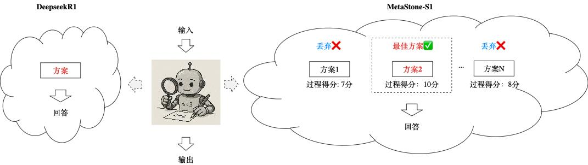

<div align="center">
  <br>
  <a href="./README.md">English</a> &nbsp;|&nbsp;
  <a href="./README_zh.md">简体中文</a>
</div>

## 更新
+ **2025.08.01**: 我们发布了**XBai o4**，*o=open*，o4代表我们开源的第四代大模型技术。XBai o4在**复杂推理能力方面表现出色**，在Medium模式下，XBai o4 现已全面超越OpenAI-o3-mini。查看[模型地址](https://huggingface.co/MetaStoneTec/XBai-o4)以获取更多信息！

## 简介


**XBai o4**是基于反思型生成范式训练得到。反思型生成范式是将 **“Long-CoT强化学习”与“过程评分学习”融合的训练范式**，该范式使单个模型同时具备“深度推理”与“高质量推理链路筛选”的能力。通过共享过程评分和策略模型的主干网络，该范式显著降低了99%的过程评分推理耗时，实现了又快又好的文本回答效果。



本仓库包括了XBai o4的训练代码和测试代码。有关模型算法的详细内容请参考[《Test-Time Scaling with Reflective Generative Model》](https://arxiv.org/abs/2507.01951)和[问小白官网](https://www.wenxiaobai.com/)。

## 环境配置
```bash
conda create -n xbai_o4 python==3.10 
conda activate xbai_o4
pip install -e verl
pip install -r requirements.txt
pip install flash_attn==2.7.4.post1
```

## 模型下载

| Model|Transformers(HF) | ModelScope |
|---------------|---------|---------|
|XBai o4|[XBai o4](https://huggingface.co/MetaStoneTec/XBai-o4)|[XBai o4](https://modelscope.cn/models/MetaStoneTec/XBai-o4)|

## 模型性能

| Model                        | AIME24 | AIME25 | LiveCodeBench v5| C-EVAL |
|------------------------------|--------|--------|----------------|--------|
| s1-32B                       | 56.7   | 50.0   | -              | -      |
| QwQ-32B                      | 79.5   | 69.5   | 62.7           | 88.4   |
| R1-Distill-Qwen-32B          | 72.6   | 49.6   | 54.5           | 82.2   |
| GLM-Z1-32B-0414              | 80.8   | 63.6   | -            | -      |
| DeepSeek-R1-671B-0120             | 79.8   | 70.0   | 64.3    | **91.8** |
| Claude-3.5-Sonnet1022        | 16.0   | 7.4    | 40.2           | 76.7   |
| GPT-4o-0513                  | 9.3    | 11.6   | 32.3           | -      |
| OpenAI-o1-mini               | 63.6   | 50.7   | 49.4           | 68.9   |
| OpenAI-o1-1217               | 79.2   | -      | 63.9           | -      |
| OpenAI-o3-mini-medium        | 79.6   | 74.8 | 66.3   | 75.9   |
| Claude Opus 4                | 75.7   | 75.5 | 61.3   | -      |
| Qwen3-32B                    | 81.4   | 72.9 | 65.7   | 87.3   |
| **XBai o4-low** | 82.4   | 74.8   | 66.6           | 89.4   |
| **XBai o4-medium** | <ins>85.4</ins>   | <ins>77.6</ins>   | <ins>67.0</ins>           | 89.5   |
| **XBai o4-high** | **86.5** | **77.9**   | **67.2**           | <ins>89.7</ins>   |

## 训练

#### 单机训练
```bash
export WANDB_API_KEY=YOUR_WANDB_API_KEY
bash ./scripts/run_single_node.sh
```

#### 多机训练
```bash
# 启动ray
bash ./verl/examples/ray/run_worker_n.sh
# 启动训练
bash ./scripts/run_multi_node.sh
```

#### 保存Huggingface格式的模型参数
```bash
cd ./verl/scripts
bash model_merger.sh
```

## 评估
我们开放了基础版本的测试代码，以及针对数学测试基准的测试流程。

#### 1、部署奖励模型API
```bash
CUDA_VISIBLE_DEVICES=0 python test/score_model_queue.py --model_path path/to/huggingface/model --score_model_dim 1536 --lang 'en' --ip '0.0.0.0' --port '8001'
```

#### 2、部署策略模型API
```bash
export VLLM_ATTENTION_BACKEND=XFORMERS
CUDA_VISIBLE_DEVICES=0 python test/policy_model_queue.py --model_path path/to/huggingface/model --ip '0.0.0.0' --port '8000'
```
推荐同时部署多个API以提高测试效率

#### 3、在目标数据集上进行推理
```bash
python test/inference.py --task 'aime24' --input_file data/aime24.jsonl --output_file path/to/result --n_samples 16 --model_dir path/to/huggingface/model --score_api_url http://ip:port/score --response_api_url "http://ip1:port1/score,http://ip2:port2/score" --branch 2
```
推荐设置branch为2倍的策略模型API数量

#### 4、计算pass@1指标
```bash
python test/compute_metric.py --task 'aime24' --result_paths path/to/result --N 2
```
设置N为2/8/32 对应 low/medium/high 模式

## 引用
如果您觉得我们的工作有所帮助，欢迎引用。
```
@misc{wang2025testtimescalingreflectivegenerative,
 title={Test-Time Scaling with Reflective Generative Model}, 
 author={Zixiao Wang and Yuxin Wang and Xiaorui Wang and Mengting Xing and Jie Gao and Jianjun Xu and Guangcan Liu and Chenhui Jin and Zhuo Wang and Shengzhuo Zhang and Hongtao Xie},
 year={2025},
 eprint={2507.01951},
 archivePrefix={arXiv},
 primaryClass={cs.LG},
 url={https://arxiv.org/abs/2507.01951}, 
}
```
